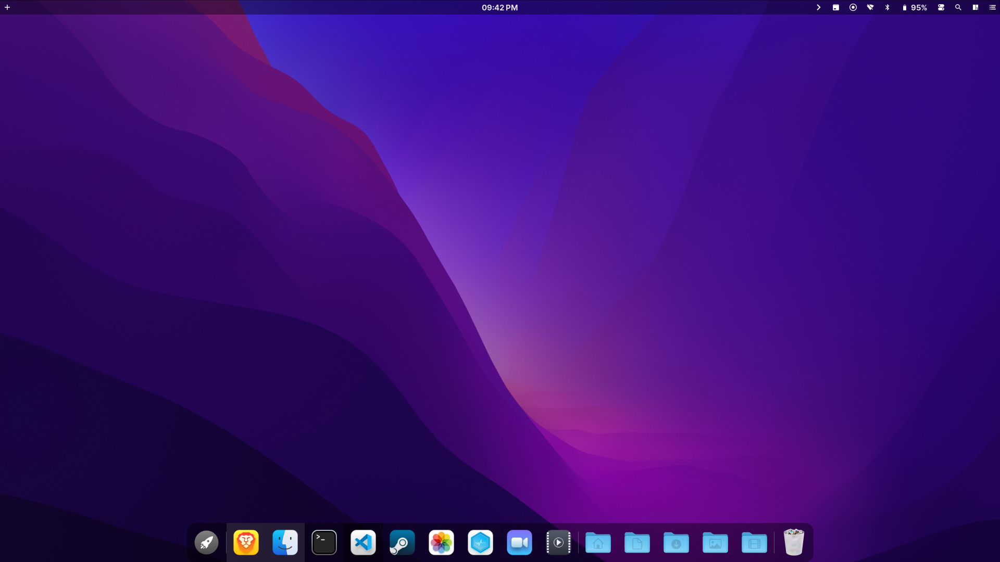
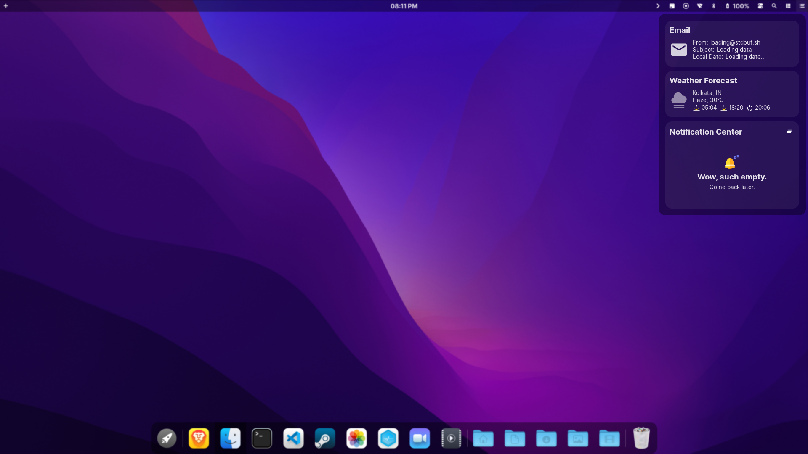
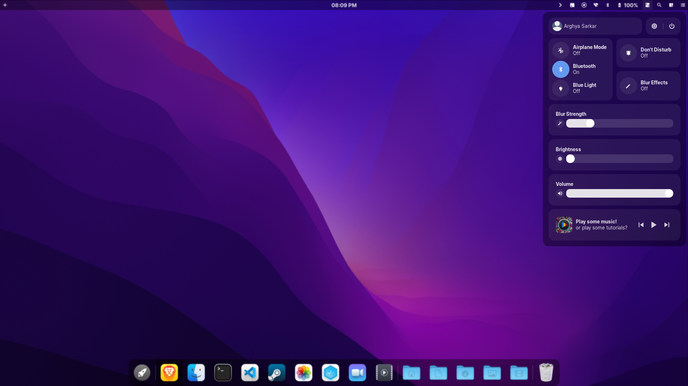

<div align='center'>
    <h3>
    	
    </h3>
    <p align='center'>
    	<strong>
			A custom MacOS Moneterey Clone for awesomeWM
    	</strong>
    </p>
</div>

<div align='center'>
	<a href='https://github.com/manilarome/the-glorious-dotfiles/wiki'>
		
	</a>
	<a href='https://github.com/manilarome/the-glorious-dotfiles/wiki/Dependencies'>
		
	</a>
	<a href='https://github.com/manilarome/the-glorious-dotfiles/wiki/Getting-Started'>
		
	</a>
	<a href='https://github.com/manilarome/the-glorious-dotfiles/wiki/Gallery'>
		
	</a>
	<br>
	<br>
</div>

<p align='center'>
	
	<br/>
	<b>
		Welcome to the ultimate awesomewm Moneterey config!
	</b>
</p>

## [Wiki here](https://github.com/manilarome/the-glorious-dotfiles/wiki)

The wiki will guide you to replicate my setups. So read the frickin' manual! If you post an issue that can be solve by reading it, I'll drop kick you.

## Summary and details

If you're too lazy to read the wiki, here's some of the details you need to know.
### Starring

- [`archlinux`](https://www.archlinux.org/download/) as distribution
- [`fish`](https://fishshell.com/) as shell
- [`awesomewm`](https://awesomewm.org) as window manager
- [`kitty`](https://github.com/kovidgoyal/kitty) as terminal emulator
- [`picom-git`](https://github.com/yshui/picom) as compositor
- [`rofi`](https://github.com/davatorium/rofi) as application launcher
- [`inter-font`](https://github.com/rsms/inter/) as the setup font

### Special Appearances

- [`brave-bin`](https://www.github.com/brave/brave-browser) as distribution
- [`steam`](https://github.com/ValveSoftware/steam-for-linux) as game store
- [`visual-studio-code-bin`](https://github.com/microsoft/vscode) as text editor
- [`kitty`](https://github.com/kovidgoyal/kitty) as terminal emulator
- [`nautilus`](https://github.com/gnome/nautilus) as file manager
- [`gimp`](https://gimp.org) as graphics tool
- [`virtualbox`](https://www.virtualbox.org/) as sandbox

### Required dependencies

| Name | Description | Why/Where is it needed? |
| --- | --- | --- |
| [`awesome-git`](https://github.com/awesomeWM/awesome) |  Highly configurable framework window manager | Isn't it obvious? |
| [`rofi`](https://github.com/davatorium/rofi) | Window switcher, application launcher and dmenu replacement | Application launcher |
| [`picom-git`](https://github.com/yshui/picom) | A compositor for X11 | A compositor with kawase-blur |
| [`inter-font`](https://github.com/rsms/inter/) | A typeface specially designed for user interfaces | Setup font | 

### Installation and usage

1. Install the [required dependencies](#required-dependencies). Note that there's also an [optional dependencies](https://github.com/manilarome/the-glorious-dotfiles/wiki#optional-dependencies).

Now dear arch users, lemme summarize the whole thing for you

```bash
yay -S rofi awesome-git picom-git inter-font light-git mpd mcd alsa-utils pulseaudio pulseaudio-alsa acpi acpid maim xclip xfce4-power-manager feh nm-applet pnmixer xorg-xinput noto-fonts-emoji upower xdg-user-dirs ffmpeg iw iproute2
```

2. Clone this repository.

	```bash
	$ git clone https://github.com/Mengo-Team/MkOsh
	```

3. Make sure to create a backup if you have a current AwesomeWM configuration.
4. Copy the folder to your `"${HOME}"/.config/`. I'll just assume that you don't have an `awesome` folder in your `~/.config/`:

	```bash
	$ cp -r MkOsh/* $HOME/.config/awesome
	```

4. Change the global configuration in `$HOME/.config/awesome/configuration/config.lua`.
5. Set the rofi config:

```bash
mkdir -p ~/.config/rofi
cp $HOME/.config/awesome/configuration/rofi/appmenu/rofi.rasi  ~/.config/rofi/config.rasi
sed -i '/@import/c\@import "'$HOME'/.config/awesome/configuration/rofi/appmenu/rofi.rasi"' ~/.config/rofi/config.rasi
```
6. Reload AwesomeWM. (Ctrl+Super+R)
### Core features

These are the features included in my MkOsh setups!

+ Notification Center
+ Dynamic Wallpaper
+ File/Web Searching like macOS' Spotlight
+ Application Dashboard
+ Brightness and Volume OSDs
+ Functional Trash Widget
+ Built-in Screen Recorder Widget
+ Built-in Calculator Widget
+ Beautiful and Elegant UI
+ Email Widget
+ Weather Widget
+ Quake Terminal
+ Hardware Monitor
+ Blue Light Filter Widgets 
+ Lockscreen Module with Face Capture and PAM Integration
+ Lightweight 
+ Any many more!

I don't really rice just to make it beautiful, I want it to be also functional so that's why it's ***"bloated"*** with features.

### Gallery

<p align='center'>
	
	
	
	<br/>
	<b>
		MkOsh
	</b>
	<>br>
</p>


## Credits

- [awesomewm devs](https://github.com/awesomeWM/awesome/graphs/contributors)
- The community of course
